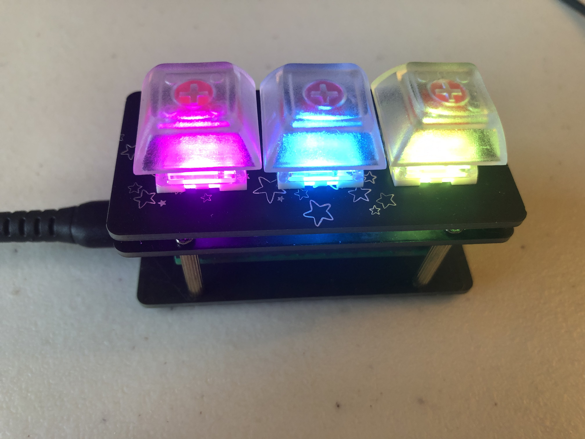

# Macro Keyboard

This is the CircuitPY code that runs on my Raspberry PI Pico, that I use as a Macro Keyboard. Currently just a set of macros for Roblox Bedwars, thinking of adding profiles later.

## Picture

